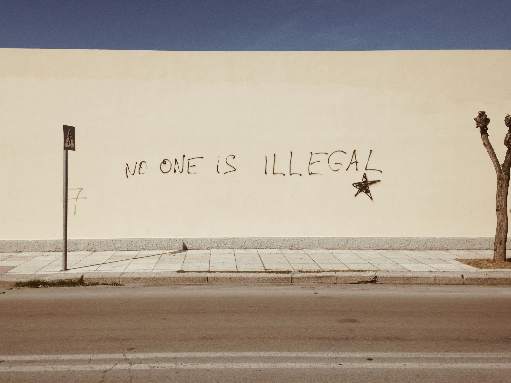
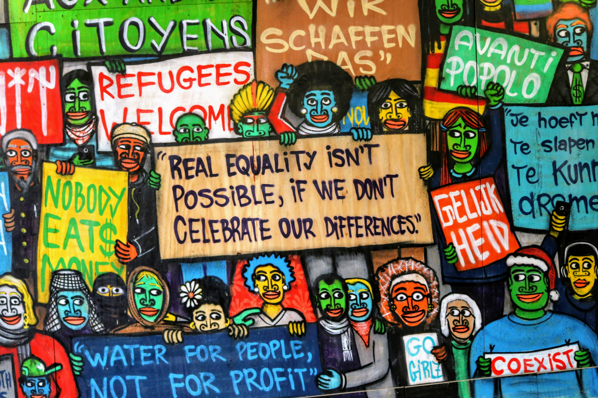

# Explorando os Recursos de IA Generativa com Copilot e OpenAI   

## Como Entregar esse projeto?

1. Crie um novo repositório no github com um nome a sua preferência
2. Crie uma pasta chamada 'inputs' e salve as imagens que você utilizou
3. Crie uma pasta chamado 'output' e salve os resultados de reconhecimento de texto nessas imagens
4. Crie um arquivo chamado readme.md , deixe alguns prints descreva o processo, alguns insights e possibilidades que você aprendeu durante o conteúdo.
5. Compartilhe conosco o link desse repositório através do botão 'entregar projeto'

## Imagens usadas no Copilot e OpenAI e respostas obtidas

Resposta da ferramenta: Na imagem está escrito “NO ONE IS ILLEGAL.”

Esta imagem mostra uma mensagem “NO ONE IS ILLEGAL” escrita em uma parede, chamando a atenção por sua declaração ousada sobre os direitos humanos e a imigração.

Resposta da ferramenta: A imagem contém vários textos escritos em diferentes idiomas e estilos, incluindo "CITOYENS", "REFUGEES WELCOME", "REAL EQUALITY ISN'T POSSIBLE, IF WE DON'T CELEBRATE OUR DIFFERENCES", "WATER FOR PEOPLE, NOT FOR PROFIT", e outros.

Esta imagem mostra um mural colorido com mensagens que promovem a união, a diversidade e a justiça social, tornando-a interessante devido ao seu apelo visual vibrante e às poderosas mensagens transmitidas.

Na imagem está escrito “VGTNYC” em letras vermelhas.

Esta imagem mostra o texto “VGTNYC” pintado com spray em vermelho em uma superfície com grafites desbotados e ilegíveis, capturando o contraste de marcas novas e antigas.

## Insights obtidos
A ferramenta conseguiu identificar os textos nas imagens e fornecer respostas sobre o conteúdo das presente nas ilustrações.

## Links Importantes
[Explore generative AI with Microsoft Copilot](https://microsoftlearning.github.io/mslearn-ai-fundamentals/Instructions/Labs/12-generative-ai.html)     

[Explore Azure OpenAI](https://microsoftlearning.github.io/mslearn-ai-fundamentals/Instructions/Labs/13-azure-openai.html)

[Explore content filters in Azure OpenAI](https://microsoftlearning.github.io/mslearn-ai-fundamentals/Instructions/Labs/14-azure-openai-content-filters.html)

 